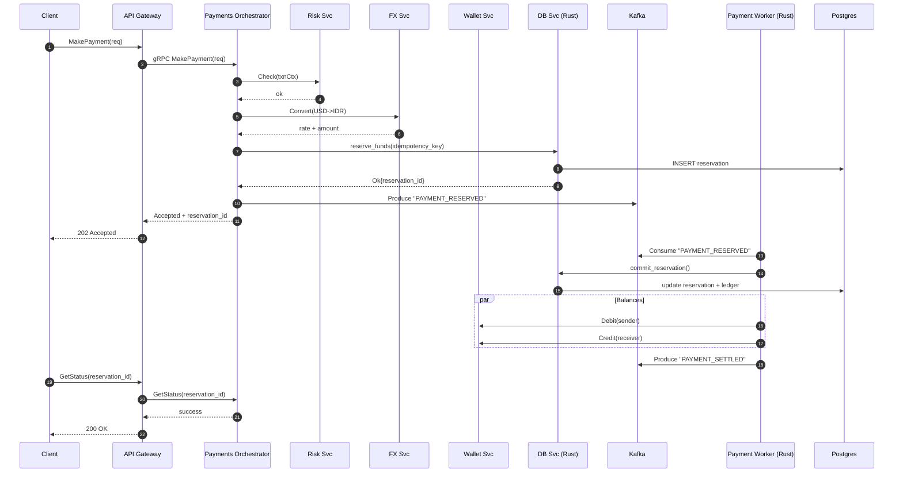

# Real-Time Multi-Currency Payment Gateway (PoC)

```
==============================================================================
Project : Real-Time Multi-Currency Payment Gateway (PoC)
Version : 0.1.0
Author  : Alok
License : MITk

Summary : A monorepo Proof of Concept for a real-time multi-currency payment
          gateway built on microservices (API Gateway, Payments, FX, Wallet,
          Risk) using gRPC, observability (Prometheus + Grafana), and tooling
          for dummy data generation and testing.
==============================================================================
```

---

## 📖 Overview

This project is a **Proof of Concept (PoC)** for a **real-time cross-currency payment system** built on a **microservices architecture**.
It combines:

* **Golang** → domain services (Wallet, FX, Risk, Payments, API Gateway)
* **Rust** → high-performance services (Database handler, Payment Worker)
* **gRPC** → inter-service communication
* **Postgres** → primary database
* **Kafka** → message broker for the event-driven payment worker
* **Prometheus + Grafana** → observability metrics and dashboards

**Goal:** Provide a modular, scalable, and resilient architecture that can serve as a blueprint for modern payment systems.

---

## ⚙️ Key Features

* **gRPC Microservices** for Wallet, FX, Risk, and Payments domains.
* **Multi-currency FX Service** with dummy exchange rates for USD, IDR, and SGD.
* **Idempotency** to prevent double-spending or duplicate reservations.
* **Risk Service** — a simple rule engine for fraud detection.
* **Async Worker (Rust)** — settlement via Kafka.
* **Observability** — Prometheus + Grafana dashboards ready to use.
* **Testing Tools** — end-to-end tests, load tests, and a dummy data generator.

---

## 🏗️ Architecture

```
flowchart LR;

%% Clients
C1[Web / Mobile Client]:::client
G[API Gateway (Go)\nHTTP + gRPC]:::gw

%% Go Services
subgraph GO[Go Services]
  W[Wallet Svc]:::svc
  FX[FX Svc]:::svc
  R[Risk Svc]
```

---

## 🔄 Sequence Diagram: MakePayment Flow



---

## 📂 Directory Structure

Key directories:

* `cmd/` → entry points for each service (wallet-grpc, payments-grpc, etc.)
* `services/` → service implementations (`api-gateway`, `db-rs`, `payments-rs`, etc.)
* `proto/` → Protobuf definitions
* `deployments/` → Docker Compose and Kubernetes manifests
* `grafana/` & `prometheus/` → observability setup
* `tests/` → end-to-end and load testing
* `tools/` → dummy data generator

---

## ⚙️ Environment Setup

### Prerequisites

* Docker & Docker Compose
* Go 1.23+
* Rust (nightly, cargo, sqlx-cli)
* Protoc compiler
* Node.js (for end-to-end tests)

### Running the Stack

```bash
# Clone the repository

# Generate dummy data
make gen-dummy

# Start the stack with Docker Compose
make dev-grpc

# Stop the stack
make down-grpc
```

---

## 🔌 Published Ports (Docker Compose)

All ports exposed when running the stack via `docker-compose`:

| Service           | Port(s)   | Description             |
| ----------------- | --------- | ----------------------- |
| Postgres          | **15432** | Primary database        |
| Kafka             | **9092**  | Message broker          |
| Kafka UI          | **9081**  | Kafka web UI            |
| Kafka Exporter    | **9308**  | Kafka metrics           |
| API Gateway       | **18080** | HTTP/REST + gRPC        |
| Wallet gRPC       | **19093** | gRPC service            |
| Wallet Metrics    | **19103** | Prometheus /metrics     |
| FX gRPC           | **19102** | gRPC service            |
| Risk gRPC         | **19094** | gRPC service            |
| Risk Metrics      | **19104** | Prometheus /metrics     |
| DB Service (Rust) | **19095** | gRPC service            |
| DB Metrics        | **19105** | Prometheus /metrics     |
| Payments-RS       | **19096** | gRPC service            |
| Payments Metrics  | **19106** | Prometheus /metrics     |
| Prometheus        | **19097** | Monitoring              |
| Grafana           | **3000**  | Dashboard               |

> **Note:** Use these mappings to access services directly via tools like `grpcurl`, `psql`, or a browser.

---

## 🔌 gRPC Endpoints

* **WalletService**: `GetBalance`, `Debit`, `Credit`
* **FXService**: `Convert(From, To, Amount)`
* **PaymentsService**: `MakePayment`, `GetStatus`
* **RiskService**: `Check(Transaction)`

---

## 📊 Monitoring

* Prometheus config → `prometheus/prometheus.yml`
* Grafana dashboard → `grafana/grafana_payment_gateway_dashboard.json`

---

## 🧪 Testing

### Start

```bash
./clean-start.sh
```

---

## 📌 Notes

* Rust services are used for high-performance critical paths.
* Go services handle orchestration and domain logic.
* This PoC can serve as a solid foundation for a production implementation.

---

## 👨‍💻 Contributor

* **Alok**
